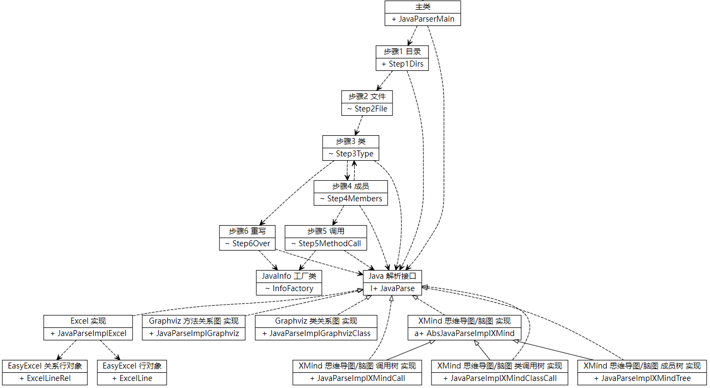
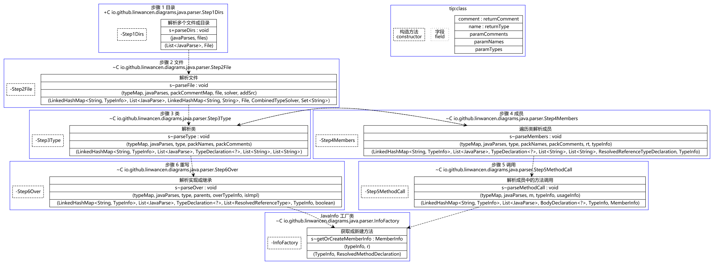
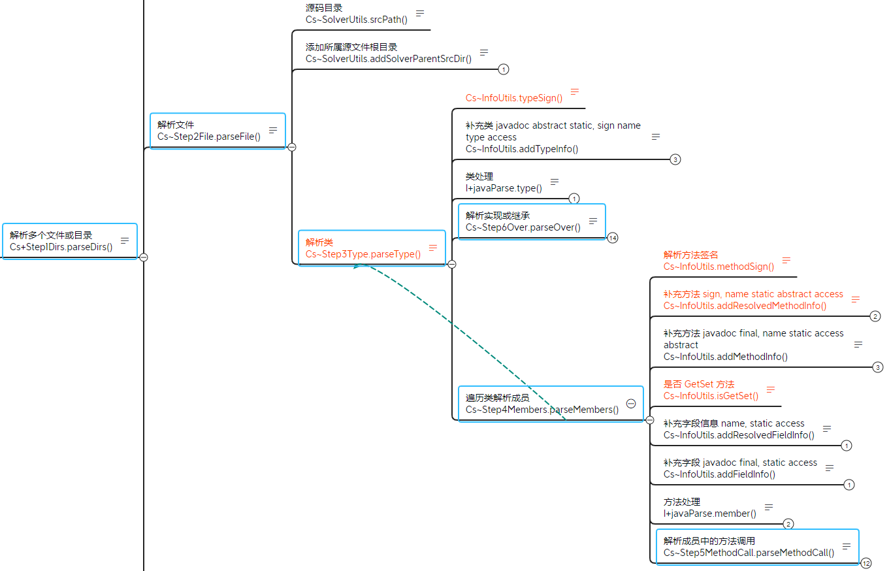

# Java 代码生成关系图 java-to-diagrams

- 测试版，名字结构和算法可能大幅重构，若出现异常可以直接调试修改源码
- 国外 GitHub 反馈地址：https://github.com/linwancen/java-to-diagrams/issues
- 国内 Gitee  反馈地址：https://gitee.com/LinWanCen/java-to-diagrams/issues
- 互联网反馈邮箱 1498425439@qq.com

## 使用指南 USE
- IDEA 可以选中文件夹 Ctrl + Shift + C 复制路径

### 图形界面
1. 运行 [JavaParserMain.java](src/main/java/io/github/linwancen/diagrams/JavaParserMain.java)

### 直接使用
- **需设置 Maven 环境变量`M2_HOME`和`JAVA_HOME`并把它们的`bin`目录设置到`path`**
- 编辑 [conf.properties](src/main/resources/conf.properties) 可以修改配置
1. 编辑 [JavaParseMainTest.java](src/test/java/io/github/linwancen/diagrams/java/parser/JavaParseMainTest.java) 粘贴路径
2. 运行 JavaParseMainTest.java

### 嵌入项目
1. 使用 `mvn install` 安装到本地
2. 添加 `Maven` 依赖
3. 拷贝 [JavaParseMainTest.java](src/test/java/io/github/linwancen/diagrams/java/parser/JavaParseMainTest.java) 到项目中
4. 拷贝 [conf.properties](src/main/resources/conf.properties) 到项目中，\
   可以设置`parser_solver_auto`开头的两个选项为`false`，**大幅提升运行速度**
5. 运行 JavaParseMainTest.java

## 已完成 DONE
- 思维导图 调用树 多调用时复制并标红
- 思维导图 类调用树 多调用时复制并标红
- 思维导图 成员树
- 类关系图（**需要安装 Graphviz 并把它的`bin`目录设置到`path`**）
- 方法关系图（**需要安装 Graphviz 并把它的`bin`目录设置到`path`**）
- Excel 表格

- 根据包名自动添加源文件根路径
- 自动向上查找 pom.xml 文件执行`dependency:build-classpath`获取依赖 jar
- Maven 环境变量兼容`M2_HOME`和`MAVEN_HOME`

## 未完成 TODO
- 思维导图 调用树 用的缓存到内存中功能可关闭以支持超大扫描
- 关系图 与 调用树 实现统一
- 数据库

## 已知问题 FIXME
- 接口抽象类混合中间未重写方法时断线问题
- JavaParser 未能解析::调用

## 贡献代码注意 NOTE

## 开发参考

[XMind API](https://github.com/xmindltd/xmind/wiki/UsingXmindAPI)

[颜色设置参考](https://github.com/xmindltd/xmind/wiki/UsingXmindAPI#setting-the-style-or-making-topics-look-pretty)

旧版本没有`Styles`这个类，找下代码

[Styles.java#L161](https://github.com/xmindltd/xmind/blob/master/bundles/org.xmind.ui.mindmap/src/org/xmind/ui/style/Styles.java#L161)

[DOMConstants.java#L45](https://github.com/xmindltd/xmind/blob/master/bundles/org.xmind.core/src/org/xmind/core/internal/dom/DOMConstants.java#L45)

可以在 xmind 文件中设置好保存，然后用VSCode打开，搜索节点，看属性怎么设置的

## 代码扫描 SonarCloud

指标  | 徽章
---   | ---
安全  | 
可维护| 
可靠性| 
错误  | 
漏洞  | 
代码行| 

## 效果图

仅供参考 |
---|
 |
 |
 |